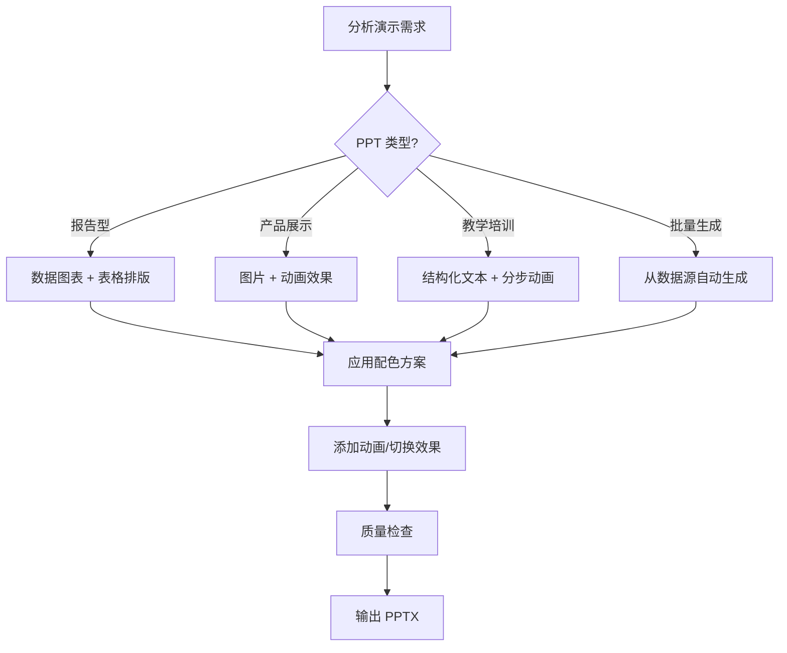

# PPT 生成与美化

## 何时使用
- 需要自动生成 PowerPoint 演示文稿
- 需要为幻灯片添加高级动画效果（入场/强调/退出/路径）
- 需要应用专业的配色方案和主题
- 需要在 PPT 中插入数据图表（柱状图/折线图/饼图）
- 需要从数据源批量生成多页 PPT
- 需要统一团队演示文稿的视觉风格

## 前提条件
- Python 3.7+ 环境
- 安装 `python-pptx` 库：`pip install python-pptx`

## 工作流总览



## 步骤

### 1. 环境准备

```bash
pip install python-pptx
```

### 2. 分析演示需求

确定以下要素：

| 要素 | 说明 | 示例 |
|------|------|------|
| 🎯 用途 | 汇报/产品展示/培训/路演 | 季度汇报 |
| 👥 受众 | 管理层/客户/团队/公众 | 公司管理层 |
| 🎨 风格 | 商务/创意/极简/科技 | 商务科技风 |
| 🖍️ 主色调 | 品牌色或主题色 | 主色 #2E75B6 + 辅色 #F5A623 |
| 📐 页数 | 预计幻灯片数量 | 10-15 页 |
| 📊 内容类型 | 文本/图表/图片/视频 | 含 3 个图表 + 动画 |
| 🔄 动画需求 | 简单/中等/复杂 | 分步动画 + 页面切换 |

### 3. 选择方案

| 场景 | 推荐脚本 | 说明 |
|------|----------|------|
| 基础幻灯片 | [basic_ppt.py](./scripts/basic_ppt.py) | 标题、正文、图片、表格 |
| 数据图表 | [chart_ppt.py](./scripts/chart_ppt.py) | 柱状图、折线图、饼图 |
| 高级动画 | [animation_ppt.py](./scripts/animation_ppt.py) | 入场/强调/退出动画 + 时间轴 |
| 专业配色 | [color_scheme_ppt.py](./scripts/color_scheme_ppt.py) | 主题色、渐变色、配色模板 |
| 批量生成 | [batch_ppt.py](./scripts/batch_ppt.py) | 从 JSON/CSV 数据源自动生成 |

### 4. 核心操作

#### 4.1 基础幻灯片布局

```python
from pptx import Presentation
from pptx.util import Inches, Pt, Emu, Cm
from pptx.dml.color import RGBColor
from pptx.enum.text import PP_ALIGN, MSO_ANCHOR
from pptx.enum.shapes import MSO_SHAPE

prs = Presentation()
prs.slide_width = Inches(13.333)   # 16:9 宽屏
prs.slide_height = Inches(7.5)

# 选择幻灯片布局（0=标题, 1=标题+内容, 6=空白, 7=图片带标题...）
slide_layout = prs.slide_layouts[6]  # 空白布局
slide = prs.slides.add_slide(slide_layout)
```

#### 4.2 添加文本框与样式

```python
from pptx.util import Inches, Pt

# 添加文本框
left = Inches(0.5)
top = Inches(0.5)
width = Inches(12)
height = Inches(1.2)
txBox = slide.shapes.add_textbox(left, top, width, height)
tf = txBox.text_frame
tf.word_wrap = True

# 添加段落
p = tf.paragraphs[0]
p.text = "主标题"
p.font.size = Pt(36)
p.font.bold = True
p.font.color.rgb = RGBColor(0x2E, 0x75, 0xB6)
p.alignment = PP_ALIGN.CENTER

# 添加副标题段落
p2 = tf.add_paragraph()
p2.text = "副标题文字"
p2.font.size = Pt(18)
p2.font.color.rgb = RGBColor(0x66, 0x66, 0x66)
p2.alignment = PP_ALIGN.CENTER
p2.space_before = Pt(12)
```

#### 4.3 形状与背景

```python
# 添加矩形背景色块
shape = slide.shapes.add_shape(
    MSO_SHAPE.RECTANGLE,
    Inches(0), Inches(0), Inches(13.333), Inches(1.8)
)
shape.fill.solid()
shape.fill.fore_color.rgb = RGBColor(0x2E, 0x75, 0xB6)
shape.line.fill.background()  # 无边框

# 添加圆角矩形
rounded = slide.shapes.add_shape(
    MSO_SHAPE.ROUNDED_RECTANGLE,
    Inches(0.5), Inches(2.5), Inches(5), Inches(4)
)
rounded.fill.solid()
rounded.fill.fore_color.rgb = RGBColor(0xF5, 0xF5, 0xF5)
rounded.shadow.inherit = False

# 设置幻灯片背景
background = slide.background
fill = background.fill
fill.solid()
fill.fore_color.rgb = RGBColor(0xFF, 0xFF, 0xFF)
```

#### 4.4 表格

```python
from pptx.util import Inches, Pt
from pptx.dml.color import RGBColor

rows, cols = 5, 4
table_shape = slide.shapes.add_table(rows, cols, Inches(0.5), Inches(3), Inches(8), Inches(3))
table = table_shape.table

# 设置列宽
table.columns[0].width = Inches(2)
table.columns[1].width = Inches(2.5)
table.columns[2].width = Inches(2)
table.columns[3].width = Inches(1.5)

# 表头样式
headers = ['项目', '2026 Q1', '2026 Q2', '增长率']
for i, header in enumerate(headers):
    cell = table.cell(0, i)
    cell.text = header
    cell.fill.solid()
    cell.fill.fore_color.rgb = RGBColor(0x2E, 0x75, 0xB6)
    for paragraph in cell.text_frame.paragraphs:
        paragraph.font.size = Pt(12)
        paragraph.font.bold = True
        paragraph.font.color.rgb = RGBColor(0xFF, 0xFF, 0xFF)
        paragraph.alignment = PP_ALIGN.CENTER
```

#### 4.5 图片

```python
# 添加图片
pic = slide.shapes.add_picture(
    'chart.png',
    Inches(0.5), Inches(2),
    width=Inches(6)  # 高度自动等比例
)

# 图片圆角（使用裁剪）
pic.crop_top = 0
pic.crop_bottom = 0
pic.crop_left = 0
pic.crop_right = 0
```

#### 4.6 数据图表

```python
from pptx.enum.chart import XL_CHART_TYPE, XL_LEGEND_POSITION
from pptx.chart.data import CategoryChartData

# 准备图表数据
chart_data = CategoryChartData()
chart_data.categories = ['1月', '2月', '3月', '4月', '5月', '6月']
chart_data.add_series('2026 年', (85, 92, 88, 96, 94, 98))

# 添加柱状图
chart_frame = slide.shapes.add_chart(
    XL_CHART_TYPE.COLUMN_CLUSTERED,
    Inches(0.5), Inches(2.5),
    Inches(8), Inches(4.5),
    chart_data
)

chart = chart_frame.chart
chart.has_legend = True
chart.legend.position = XL_LEGEND_POSITION.BOTTOM
chart.legend.include_in_layout = False

# 图表样式
plot = chart.plots[0]
plot.gap_width = 100  # 柱间距

# 设置系列颜色
series = plot.series[0]
series.format.fill.solid()
series.format.fill.fore_color.rgb = RGBColor(0x2E, 0x75, 0xB6)
```

### 5. 高级动画效果

> **注意：** `python-pptx` 对动画的支持需要通过 XML 操作。以下展示了两种方式。

#### 5.1 使用内置 API（简单动画）

```python
from pptx.oxml.ns import qn
from lxml import etree

def add_animation_to_shape(shape, anim_type='fade'):
    """
    为形状添加入场动画
    anim_type: 'fade' (淡入), 'fly_in' (飞入), 'zoom' (缩放)
    """
    # 创建动画定时器节点
    ts = slide._element.makeelement(qn('p:transition'), {})
    # 实际项目中需要用更复杂的 XML 操作
    # 以下为概念示例
    pass


# 更实用的做法是使用 VBA 宏或手动在 PowerPoint 中设置动画
# python-pptx 生成的 PPTX 可以在 PowerPoint 中轻松添加动画
```

#### 5.2 使用 VBA 宏添加动画

创建 VBA 宏脚本 `[add_animation.vba](./scripts/add_animation.vba)`，在 PowerPoint 中运行：

```vba
Sub AddAnimations()
    Dim slide As slide
    Dim shape As shape
    
    For Each slide In ActivePresentation.Slides
        For Each shape In slide.Shapes
            ' 添加淡入动画
            shape.AnimationSettings.EntryEffect = ppEffectFade
            shape.AnimationSettings.Animate = msoTrue
        Next shape
    Next slide
End Sub
```

#### 5.3 幻灯片切换效果

```python
from pptx.oxml.ns import qn

def set_slide_transition(slide, effect='fade', duration=1.0):
    """
    设置幻灯片切换效果
    effect: 'fade', 'push', 'wipe', 'split', 'dissolve', 'random'
    """
    transition = slide._element.makeelement(qn('p:transition'), {})
    transition.set('dur', f'P{duration}S')
    transition.set('advClick', '1')  # 点击鼠标切换
    
    # 设置切换类型（部分效果在 python-pptx 中通过 XML 支持）
    if effect == 'fade':
        fade_elem = etree.SubElement(transition, qn('p:fade'))
        fade_elem.set('throughBlk', '0')
    elif effect == 'push':
        push_elem = etree.SubElement(transition, qn('p:push'))
        push_elem.set('dir', 'ltr')  # 从左到右
    elif effect == 'random':
        etree.SubElement(transition, qn('p:randomBar'))
        etree.SubElement(transition, qn('p:randomTransition'))
    
    # 替换现有 transition
    old_trans = slide._element.find(qn('p:transition'))
    if old_trans is not None:
        slide._element.remove(old_trans)
    slide._element.append(transition)
```

### 6. 专业配色方案

#### 6.1 预设配色模板

| 主题 | 主色 | 辅色 1 | 辅色 2 | 背景色 | 适用场景 |
|------|------|--------|--------|--------|----------|
| 🌊 **商务蓝** | #1A5276 | #2E86C1 | #85C1E9 | #F8F9FA | 正式汇报 |
| 🌿 **自然绿** | #1E8449 | #27AE60 | #82E0AA | #F0FFF0 | 环保/健康 |
| 🔥 **热情橙** | #D35400 | #E67E22 | #FAD7A1 | #FFFBF5 | 营销/活动 |
| 💜 **典雅紫** | #6C3483 | #8E44AD | #D2B4DE | #FDF8FF | 创意/品牌 |
| 🎯 **科技蓝** | #0F172A | #3B82F6 | #60A5FA | #F0F9FF | 科技/产品 |
| 🍃 **清新风** | #0D9488 | #14B8A6 | #99F6E4 | #F5FFFE | 生活/健康 |

#### 6.2 代码设置配色

```python
def apply_color_scheme(slide, scheme='business_blue'):
    """为幻灯片应用配色方案"""
    schemes = {
        'business_blue': {
            'primary': RGBColor(0x1A, 0x52, 0x76),
            'secondary': RGBColor(0x2E, 0x86, 0xC1),
            'accent': RGBColor(0x85, 0xC1, 0xE9),
            'background': RGBColor(0xF8, 0xF9, 0xFA),
            'text': RGBColor(0x2C, 0x3E, 0x50),
            'light_text': RGBColor(0x7F, 0x8C, 0x8D),
        },
        'tech_blue': {
            'primary': RGBColor(0x0F, 0x17, 0x2A),
            'secondary': RGBColor(0x3B, 0x82, 0xF6),
            'accent': RGBColor(0x60, 0xA5, 0xFA),
            'background': RGBColor(0xF0, 0xF9, 0xFF),
            'text': RGBColor(0x1E, 0x29, 0x3B),
            'light_text': RGBColor(0x64, 0x74, 0x8B),
        },
        'nature_green': {
            'primary': RGBColor(0x1E, 0x84, 0x49),
            'secondary': RGBColor(0x27, 0xAE, 0x60),
            'accent': RGBColor(0x82, 0xE0, 0xAA),
            'background': RGBColor(0xF0, 0xFF, 0xF0),
            'text': RGBColor(0x1C, 0x3D, 0x2A),
            'light_text': RGBColor(0x6B, 0x8E, 0x76),
        },
    }
    return schemes.get(scheme, schemes['business_blue'])


# 使用配色
colors = apply_color_scheme(slide, 'tech_blue')
title_run.font.color.rgb = colors['primary']
body_run.font.color.rgb = colors['text']
shape.fill.fore_color.rgb = colors['secondary']
```

#### 6.3 渐变色背景

```python
def set_gradient_background(slide, color1, color2, angle=0):
    """为幻灯片设置渐变色背景"""
    bg = slide.background
    fill = bg.fill
    fill.gradient()
    fill.gradient.angle = angle  # 0=水平, 90=垂直
    
    # 设置渐变 stops
    stops = fill.gradient.stops
    stops[0].position = 0.0
    stops[0].color.rgb = color1
    stops[1].position = 1.0
    stops[1].color.rgb = color2


# 示例：从深蓝渐变到浅蓝
set_gradient_background(
    slide,
    RGBColor(0x0F, 0x17, 0x2A),   # 深色
    RGBColor(0x2E, 0x86, 0xC1),   # 浅色
    angle=90  # 垂直渐变
)
```

### 7. 批量生成

```python
import json
from pptx import Presentation
from pptx.util import Inches, Pt

# 从 JSON 数据源批量生成
def generate_from_json(data_file, output_file):
    with open(data_file, 'r', encoding='utf-8') as f:
        data = json.load(f)

    prs = Presentation()
    prs.slide_width = Inches(13.333)
    prs.slide_height = Inches(7.5)

    for item in data['slides']:
        slide_layout = prs.slide_layouts[6]  # 空白
        slide = prs.slides.add_slide(slide_layout)

        # 标题
        txBox = slide.shapes.add_textbox(Inches(0.5), Inches(0.3), Inches(12), Inches(1))
        tf = txBox.text_frame
        p = tf.paragraphs[0]
        p.text = item['title']
        p.font.size = Pt(32)
        p.font.bold = True
        p.font.color.rgb = RGBColor(0x2E, 0x75, 0xB6)

        # 正文
        txBox2 = slide.shapes.add_textbox(Inches(0.5), Inches(1.5), Inches(12), Inches(5))
        tf2 = txBox2.text_frame
        tf2.word_wrap = True
        for line in item.get('body', []):
            p2 = tf2.add_paragraph()
            p2.text = line
            p2.font.size = Pt(18)

    prs.save(output_file)
    print(f"已生成: {output_file}")
```

### 8. 模板使用

本技能提供 [模板文件](./templates/)，可直接参考使用：

| 模板 | 说明 |
|------|------|
| [business_template.py](./templates/business_template.py) | 商务汇报 PPT 模板 |
| [product_template.py](./templates/product_template.py) | 产品介绍 PPT 模板 |
| [report_template.py](./templates/report_template.py) | 数据报告 PPT 模板 |

## 决策树

```
PPT 生成需求
├── 单页/少量幻灯片 → 参考【步骤 4】核心操作，组合使用
├── 需要数据图表
│   ├── 柱状图/折线图 → chart_ppt.py
│   └── 饼图 → 使用 XL_CHART_TYPE.PIE
├── 需要动画效果
│   ├── 简单动画 → 在 PowerPoint 中手动添加
│   └── 幻灯片切换 → 使用 set_slide_transition()
├── 需要专业配色
│   ├── 使用预设 → 参考【步骤 6.1】配色模板
│   └── 自定义配色 → apply_color_scheme()
└── 需要批量生成 → 参考【步骤 7】batch_ppt.py
```

## 质量检查清单
- [ ] 幻灯片尺寸是否正确（16:9 / 4:3）
- [ ] 标题层级清晰、字号统一
- [ ] 配色方案一致，文字与背景对比度足够
- [ ] 图表数据准确、标签完整
- [ ] 图片清晰且未拉伸变形
- [ ] 表格对齐工整、表头样式统一
- [ ] 动画时间轴合理、无冲突
- [ ] 幻灯片切换效果连贯
- [ ] 所有字体在目标电脑上可用（或嵌入字体）
- [ ] 文件打开无错误

## 常见问题

| 问题 | 解决方案 |
|------|----------|
| 中文乱码 | 确保指定中文字体（如微软雅黑） |
| 图表颜色不对 | 使用 `series.format.fill.fore_color.rgb` 单独设置 |
| 动画不生效 | python-pptx 动画支持有限，可在 PowerPoint 中补充 |
| 图片过大 | 使用 `width` 参数限制尺寸，或用 PIL 预处理压缩 |
| 字体缺失 | 使用常见字体（微软雅黑/宋体/Arial），或嵌入字体 |
| 表格样式丢失 | 设置每个单元格的 `fill` 和 `paragraph.font` 属性 |

## 参考资源
- [python-pptx 官方文档](https://python-pptx.readthedocs.io/)
- [python-pptx GitHub](https://github.com/scanny/python-pptx)
- [PPT 配色工具 Adobe Color](https://color.adobe.com/)
- [脚本目录](./scripts/)
- [模板目录](./templates/)
